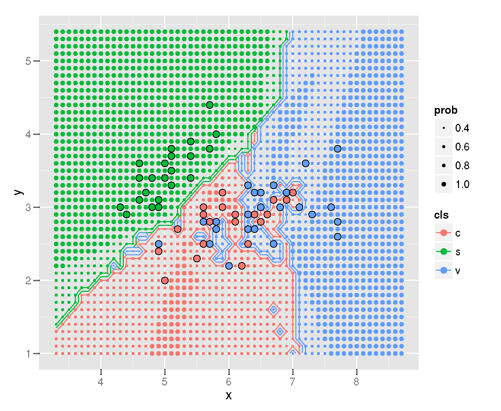
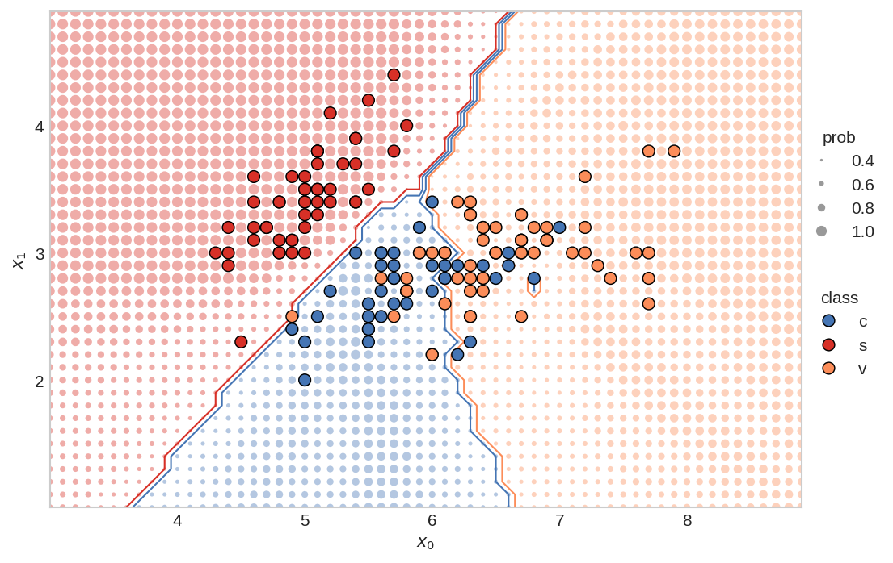
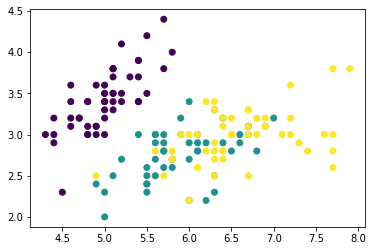
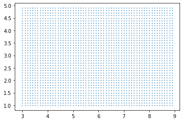

# Beautiful Plots: The Decision Boundary


> How can we communicate complex concepts using data visualization tools? In this first post -- in a series titled "Beautiful Plots" -- we build an elegant chart demonstrating the decision boundary from a KNN classifier.  

*"Brevity is the soul of wit" -- Polonius in Hamlet*

Communicating ideas through plots and charts -- the process of data visualization -- is not always easy. Oftentimes, the ideas being communicated are complex, subtle, and deep. Constructing a good data visualization requires thought, and a bit of art. Ideally, the end product should communicate ideas with minimal effort requested from the reader.

I like creating beautiful data visualizations. Perhaps it's like the artist or the musician -- there is some intrinic drive within me to make data look beautiful! I guess I've developed a "taste" over the years. As such, I've decided to start a new series called "Beautiful Plots." 

In this series, I'll create beautiful plots, often in Python and Matplotlib. I'll explore interesting creations from others. I'll look at data visualization concepts. Really, I'll go wherever the wind blows... so, in advance, thanks for coming along.

# The Decision Boundary Plot

Machine learning is filled with many complex topics. During my thesis writing, I was trying to explain the concept of the decision boundary. Naturally, I looked for ways to explain the concept with a data visualization. Then, I came upon this stackoverflow post: [Recreating decision-boundary plot in python with scikit-learn and matplotlib](https://stackoverflow.com/questions/41138706/recreating-decision-boundary-plot-in-python-with-scikit-learn-and-matplotlib). In the post, Rachel asks how to recreate the below plot in Matplotlib.

<div style="text-align: center; ">
<figure>
  
  <!-- <div style="text-align: left; "> -->
  <figcaption style="color:grey; font-size:smaller">The KNN decision boundary plot on the Iris data set. Originally created in R with ggplot (Image from <a href="https://stackoverflow.com/a/31236327/9214620">Igautier on stackoverflow</a>)</figcaption>
  <!-- </div> -->
</figure>
</div>


I like the plot. It communicates two ideas well. First, it shows where the [decision boundary](https://en.wikipedia.org/wiki/Decision_boundary) is between the different classes. Second, the plot conveys the likelihood of a new data point being classified in one class or the other. It does this by varrying the size of the array of dots. This, in my opinion, is where this plot truly shines.

Below is my rendition of the plot (and I did answer Rachel's questions -- see the [updated stackoverflow](https://stackoverflow.com/a/67245995/9214620)). I'll now walk you, the reader, through the creation of the plot. Of course, you can run the whole thing in [Google Colab](https://colab.research.google.com/github/tvhahn/Beautiful-Plots/blob/master/Decision%20Boundary/decision-boundary.ipynb) too. You can also visit [the "Beautiful-Plots" repo on github](https://github.com/tvhahn/Beautiful-Plots). 

[](https://colab.research.google.com/github/tvhahn/Beautiful-Plots/blob/master/Decision%20Boundary/decision-boundary.ipynb)

<div style="text-align: center; ">
<figure>
  
  <!-- <div style="text-align: left; "> -->
  <figcaption style="color:grey; font-size:smaller">The KNN decision boundary plot on the Iris data set, as created by me, in Matplotlib. (Image from author)</figcaption>
  <!-- </div> -->
</figure>
</div>


# Creating the Plot
[Matplotlib](https://matplotlib.org/) is an amazing, open source, visualization tool for Python. It is powerful, so can sometimes be confusing for the unenitiated. Fortunately, Matplotlib has great documentation (check out their [cheat-sheet](https://github.com/matplotlib/cheatsheets#cheatsheets)), and because Matplotlib is so widely used, you can find examples *everywhere*.

I've broken down the code into several sections. First, we'll start with loading the data.

## Load the Data
We need Numpy, Matplotlib, and scikit-learn for this plot, so we'll load those modules. We'll also be using the Iris data set, which comes conveniently with sklearn.


```python
import numpy as np
import matplotlib.pyplot as plt
from sklearn import datasets
from sklearn import neighbors
```

We'll only be using the first two features from the Iris data set (makes sense, since we're plotting a 2D chart). We'll call the features $$x_0$$ and $$x_1$$. Each feature comes with an associated class, $$y$$, representing the type of flower.


```python
iris = datasets.load_iris()
x = iris.data[:,0:2]
y = iris.target

# print the shape of the data to
# better understand it
print('x.shape:', x.shape)
print('y.shape', y.shape)

# create the x0, x1 feature
x0 = x[:,0]
x1 = x[:,1]
```

    x.shape: (150, 2)
    y.shape (150,)


To quickly visualize the data, let's plot the $$x_0$$ and $$x_1$$ features, and color them based on their class.


```python
plt.scatter(x0, x1, c=y)
plt.show()
```

<div style="text-align: center; ">
<figure>
  
</figure>
</div>

​    


## Train the Classifier
Next, we'll train the KNN classifier using scikit-learn. 

Set the number of neighbors:


```python
# set main parameters for KNN plot
N_NEIGHBORS = 15 # KNN number of neighbors
```

Implement and fit the KNN classifier:


```python
clf = neighbors.KNeighborsClassifier(N_NEIGHBORS, weights='uniform')
clf.fit(x, y)
```


    KNeighborsClassifier(n_neighbors=15)


## Define the Plot-Bounds and the Meshgrid
We need to define the min/max values for the plot. In addition, we'll create the mesh-grid, which will be used to show the probability of the class at a specific point.

Find the min/max points for both the `x0` and `x1` features. These will be used to set the bounds for the plot.


```python
PAD = 1.0 # how much to "pad" around the min/max values. helps in setting bounds of plot

x0_min, x0_max = np.round(x0.min())-PAD, np.round(x0.max()+PAD)
x1_min, x1_max = np.round(x1.min())-PAD, np.round(x1.max()+PAD)
```

Create the 1D arrays representing the range of probability data points on both the axes:


```python
H = 0.1 # mesh stepsize

x0_axis_range = np.arange(x0_min,x0_max, H)
x1_axis_range = np.arange(x1_min,x1_max, H)
```

Create the meshgrid:


```python
xx0, xx1 = np.meshgrid(x0_axis_range, x1_axis_range)

# check the shape of the meshgrid
print('xx0.shape:', xx0.shape)
print('xx1.shape:', xx1.shape)
```

    xx0.shape: (40, 60)
    xx1.shape: (40, 60)


Meshgrid can be confusing -- read this [stackoverflow explanation](https://stackoverflow.com/a/36014586/9214620) for a good summary. Essentially, to create a rectangular gride, we need every combination of the `x0` and `x1` points.

We can plot the two outputs, `xx0` and `xx1`, together to visualize the grid


```python
plt.scatter(xx0, xx1, s=0.5)
plt.show()
```

<div style="text-align: center; ">
<figure>
  
</figure>
</div>


​    


I like to have the shape of the meshgrid (the $$xx$$'s) put into the same dimensional format as the original $$x$$. The shape will then be: `[no_dots, no_dimensions]`


```python
xx = np.reshape(np.stack((xx0.ravel(),xx1.ravel()),axis=1),(-1,2))
print('xx.shape:', xx.shape)
```

    xx.shape: (2400, 2)


## Making Predictions
We can now make predictions for all the little dots. The `yy_size` will be used to create the size of the dots.


```python
# prediction of all the little dots
yy_hat = clf.predict(xx) 

# probability of each dot beingthe predicted color
yy_prob = clf.predict_proba(xx) 
                               
# the size of each probability dot
yy_size = np.max(yy_prob, axis=1) 
```

## Produce the Figure

We can make the figure!

We'll define some of the basic parameter variables:


```python
PROB_DOT_SCALE = 40 # modifier to scale the probability dots
PROB_DOT_SCALE_POWER = 3 # exponential used to increase/decrease size of prob dots
TRUE_DOT_SIZE = 50 # size of the true labels
```

... and plot! I've extensively commented this code, so I won't be providing anymore commentary.


```python
from matplotlib.ticker import MaxNLocator # needed for integer only on axis
from matplotlib.lines import Line2D # for creating the custom legend

# make figure
plt.style.use('seaborn-whitegrid') # set style because it looks nice
fig, ax = plt.subplots(nrows=1, ncols=1, figsize=(8,6), dpi=150)

# establish colors and colormap
#  * color blind colors, from https://bit.ly/3qJ6LYL
redish = '#d73027'
orangeish = '#fc8d59'
yellowish = '#fee090'
blueish = '#4575b4'
colormap = np.array([redish,blueish,orangeish])

# plot all the little dots, position defined by the xx values, color
# defined by the knn predictions (yy_hat), and size defined by the 
# probability of that color (yy_prob)
# * because the yy_hat values are either 0, 1, 2, we can use 
#   these as values to index into the colormap array
# * size of dots (the probability) increases exponentially (^3), so that there is
#   a nice difference between different probabilities. I'm sure there is a more
#   elegant way to do this though...
# * linewidths=0 so that there are no "edges" around the dots
ax.scatter(xx[:,0], xx[:,1], c=colormap[yy_hat], alpha=0.4, 
           s=PROB_DOT_SCALE*yy_size**PROB_DOT_SCALE_POWER, linewidths=0,)

# plot the contours
# * we have to reshape the yy_hat to get it into a 
#   2D dimensional format, representing both the x0
#   and x1 axis
# * the number of levels and color scheme was manually tuned
#   to make sense for this data. Would probably change, for 
#   instance, if there were 4, or 5 (etc.) classes
ax.contour(x0_axis_range, x1_axis_range, 
           np.reshape(yy_hat,(xx0.shape[0],-1)), 
           levels=3, linewidths=1, 
           colors=[redish,blueish, blueish,orangeish,])

# plot the original x values.
# * zorder is 3 so that the dots appear above all the other dots 
ax.scatter(x[:,0], x[:,1], c=colormap[y], s=TRUE_DOT_SIZE, zorder=3, 
           linewidths=0.7, edgecolor='k')

# create legends
x_min, x_max = ax.get_xlim()
y_min, y_max = ax.get_ylim()

ax.set_ylabel(r"$x_1$")
ax.set_xlabel(r"$x_0$")

# create class legend
# Line2D properties: https://matplotlib.org/stable/api/_as_gen/matplotlib.lines.Line2D.html
# about size of scatter plot points: https://stackoverflow.com/a/47403507/9214620
legend_class = []
for flower_class, color in zip(['c', 's', 'v'], [blueish, redish, orangeish]):
    legend_class.append(Line2D([0], [0], marker='o', label=flower_class,ls='None',
                               markerfacecolor=color, markersize=np.sqrt(TRUE_DOT_SIZE), 
                               markeredgecolor='k', markeredgewidth=0.7))

# iterate over each of the probabilities to create prob legend
prob_values = [0.4, 0.6, 0.8, 1.0]
legend_prob = []
for prob in prob_values:
    legend_prob.append(Line2D([0], [0], marker='o', label=prob, ls='None', alpha=0.8,
                              markerfacecolor='grey', 
                              markersize=np.sqrt(PROB_DOT_SCALE*prob**PROB_DOT_SCALE_POWER), 
                              markeredgecolor='k', markeredgewidth=0))


legend1 = ax.legend(handles=legend_class, loc='center', 
                    bbox_to_anchor=(1.05, 0.35),
                    frameon=False, title='class')

legend2 = ax.legend(handles=legend_prob, loc='center', 
                    bbox_to_anchor=(1.05, 0.65),
                    frameon=False, title='prob', )

ax.add_artist(legend1) # add legend back after it disappears

ax.set_yticks(np.arange(x1_min,x1_max, 1)) # I don't like the decimals
ax.grid(False) # remove gridlines (inherited from 'seaborn-whitegrid' style)

# only use integers for axis tick labels
# from: https://stackoverflow.com/a/34880501/9214620
ax.xaxis.set_major_locator(MaxNLocator(integer=True))
ax.yaxis.set_major_locator(MaxNLocator(integer=True))

# remove first ticks from axis labels, for looks
# from: https://stackoverflow.com/a/19503828/9214620
ax.set_xticks(ax.get_xticks()[1:-1])
ax.set_yticks(np.arange(x1_min,x1_max, 1)[1:])

# set the aspect ratio to 1, for looks
ax.set_aspect(1)

# plt.savefig('knn.svg',dpi=300,format='svg', bbox_inches = "tight")
# plt.savefig('knn.png',dpi=150,bbox_inches = "tight")
plt.show()
```

<div style="text-align: center; ">
<figure>
  
</figure>
</div>


# Putting it All Together
For compactness, here's the whole thing in a nice function, courtesy of Patrick Herber (thanks Patrick!). You can see the Google colab that he made [here](https://colab.research.google.com/drive/1LvImQffF-8V5scgLpr3OQQ-MUfKi2WRC?usp=sharing), and here's his [twitter](https://twitter.com/phrbert) and [github](https://github.com/pherber3?tab=overview&from=2021-04-01&to=2021-04-26) accounts.


```python
import warnings

def plot_decision_boundary2D(clf, X: np.ndarray, y: np.ndarray, classes: list, colormap: np.ndarray,
                             step: float = 0.1, prob_dot_scale: int = 40, prob_dot_scale_power: int = 3,
                             true_dot_size: int = 50, pad: float = 1.0,
                             prob_values: list = [0.4, 0.6, 0.8, 1.0]) -> None:
    """
    Original work by @timothyvh on Twitter.
    Recreating an R ggplot decision boundary plotting in python using matplotlib. 
    Note that this only works for 2D plotting. The goal of this function is to present a 
    classifier's decision boundary in an easy to read, digestible way to ease
    communication and visualization of results. 
    
    Arguments:
    clf - the classifier we want to visualize the decision boundary for. This should work for any kind of relevant model.
    X - our data we want to plot. Note that since this is a 2D array, X should be 2-dimensional.
    y - the target labels for the data we want to plot
    classes - the names of the classes you are trying to identify, should be same shape as colormap
    colormap - the colors you want to use to indicate your different classes, should be same shape as classes
    step - mesh stepsize
    prob_dot_scale - modifier to scale the probability dots
    prob_dot_scale_power - exponential used to increase/decrease size of prob dots
    true_dot_size - size of the true labels
    pad - how much to "pad" around the true labels
    prob_values - list of probabilities to map the meshgrid predictions to

    Returns:
    None - This function will simply output a graph of the decision boundary
    """
    # Handling X data dimension issues. If X doesn't have enough dimensions, throw error. Too many, use first two dimensions.
    X_dim = X.shape[1]
    if X_dim < 2:
        raise Exception("Error: Not enough dimensions in input data. Data must be at least 2-dimensional.")
    elif X_dim > 2: 
        warnings.warn(f"Warning: input data was {X_dim} dimensional. Expected 2. Using first 2 dimensions provided.")
    
    # Change colormap to a numpy array if it isn't already (necessary to prevent scalar error)
    if not isinstance(colormap, np.ndarray):
        colormap = np.array(colormap)        
        
    # create the x0, x1 feature. This is only a 2D plot after all. 
    x0 = X[:,0]
    x1 = X[:,1]
    
    # create 1D arrays representing the range of probability data points
    x0_min, x0_max = np.round(x0.min())-pad, np.round(x0.max()+pad)
    x1_min, x1_max = np.round(x1.min())-pad, np.round(x1.max()+pad)    
    x0_axis_range = np.arange(x0_min,x0_max, step)
    x1_axis_range = np.arange(x1_min,x1_max, step)
    
    # create meshgrid between the two axis ranges
    xx0, xx1 = np.meshgrid(x0_axis_range, x1_axis_range)
    
    # put the xx in the same dimensional format as the original X
    xx = np.reshape(np.stack((xx0.ravel(),xx1.ravel()),axis=1),(-1,2))
    
    yy_hat = clf.predict(xx) # prediction of all the little dots
    yy_prob = clf.predict_proba(xx) # probability of each dot being 
                                    # the predicted color
    yy_size = np.max(yy_prob, axis=1)
    
    # make figure
    plt.style.use('seaborn-whitegrid') # set style because it looks nice
    fig, ax = plt.subplots(nrows=1, ncols=1, figsize=(8,6), dpi=150)
    
    # plot all the little dots
    ax.scatter(xx[:,0], xx[:,1], c=colormap[yy_hat], alpha=0.4, s=prob_dot_scale*yy_size**prob_dot_scale_power, linewidths=0,)
    
    # plot the contours
    ax.contour(x0_axis_range, x1_axis_range, 
               np.reshape(yy_hat,(xx0.shape[0],-1)), 
               levels=3, linewidths=1, 
               colors=[colormap[0],colormap[1], colormap[1], colormap[2],])
 
    # plot the original x values.
    ax.scatter(x0, x1, c=colormap[y], s=true_dot_size, zorder=3, linewidths=0.7, edgecolor='k')
 
    # create legends - Not sure if these serve a purpose but I left them in just in case
    x_min, x_max = ax.get_xlim()
    y_min, y_max = ax.get_ylim()
 
    ax.set_ylabel(r"$x_1$")
    ax.set_xlabel(r"$x_0$")
    
    # set the aspect ratio to 1, for looks
    ax.set_aspect(1)
 
    # create class legend
    legend_class = []
    for class_id, color in zip(classes, colormap):
        legend_class.append(Line2D([0], [0], marker='o', label=class_id,ls='None',
                                   markerfacecolor=color, markersize=np.sqrt(true_dot_size), 
                                   markeredgecolor='k', markeredgewidth=0.7))
 
    # iterate over each of the probabilities to create prob legend
    legend_prob = []
    for prob in prob_values:
        legend_prob.append(Line2D([0], [0], marker='o', label=prob, ls='None', alpha=0.8,
                                  markerfacecolor='grey', 
                                  markersize=np.sqrt(prob_dot_scale*prob**prob_dot_scale_power), 
                                  markeredgecolor='k', markeredgewidth=0))
 
 
    legend1 = ax.legend(handles=legend_class, loc='center', 
                        bbox_to_anchor=(1.05, 0.35),
                        frameon=False, title='class')
 
    legend2 = ax.legend(handles=legend_prob, loc='center', 
                        bbox_to_anchor=(1.05, 0.65),
                        frameon=False, title='prob', )
 
    ax.add_artist(legend1) # add legend back after it disappears
 
    ax.set_yticks(np.arange(x1_min,x1_max, 1)) # I don't like the decimals
    ax.grid(False) # remove gridlines (inherited from 'seaborn-whitegrid' style)
 
    # only use integers for axis tick labels
    ax.xaxis.set_major_locator(MaxNLocator(integer=True))
    ax.yaxis.set_major_locator(MaxNLocator(integer=True))
 
    # remove first ticks from axis labels, for looks
    ax.set_xticks(ax.get_xticks()[1:-1])
    ax.set_yticks(np.arange(x1_min,x1_max, 1)[1:])
 
    plt.show()
```


```python
# set main parameters for KNN plot
N_NEIGHBORS = 15 # KNN number of neighbors
H = 0.1 # mesh stepsize
PROB_DOT_SCALE = 40 # modifier to scale the probability dots
PROB_DOT_SCALE_POWER = 3 # exponential used to increase/decrease size of prob dots
TRUE_DOT_SIZE = 50 # size of the true labels
PAD = 1.0 # how much to "pad" around the true labels

# establish colors and colormap
redish = '#d73027'
orangeish = '#fc8d59'
blueish = '#4575b4'
colormap = np.array([redish,blueish,orangeish])

#establish classes
classes = ['c','s','v']

# load data again
iris = datasets.load_iris()
x = iris.data[:,0:2]
y = iris.target

clf = neighbors.KNeighborsClassifier(N_NEIGHBORS, weights='uniform')
clf.fit(x, y)

# use function
plot_decision_boundary2D(clf, x, y.copy(), classes, colormap, 
                         step=H, 
                         prob_dot_scale=PROB_DOT_SCALE, 
                         prob_dot_scale_power=PROB_DOT_SCALE_POWER,
                         true_dot_size=TRUE_DOT_SIZE, 
                         pad=PAD,)
```

<div style="text-align: center; ">
<figure>
  
</figure>
</div>

​    


# Conclusion
I hope you've found this little blog post useful. As I come across other beautiful plots, I'll post them here. With that:

<div style="text-align: center; ">
<figure>
  
</figure>
</div>

