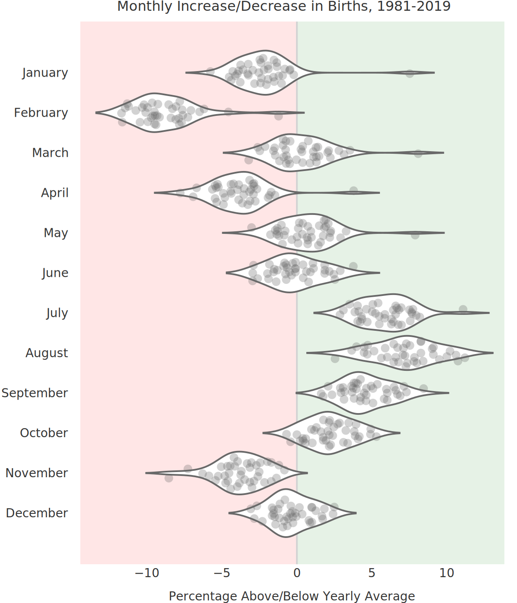

Beautiful Plots: The Violin
--- 

<div style="text-align: center; ">
<figure>
  
</figure>
</div>

> Music to my ~~ears~~... err... eyes? The violin plot is a worthy tool for any data visualization tool box. Let's build one, in Plotly, as we explore historic birth trends in the USA!
>
> You can run the Colab notebook [here](https://colab.research.google.com/github/tvhahn/Beautiful-Plots/blob/master/Violin/violin_plot.ipynb),.

One thing leads to the next...

I read about the [Apgar score](https://en.wikipedia.org/wiki/Apgar_score) (more on that in a future post) in Daniel Kahneman's book *[Thinking, Fast and Slow](https://www.amazon.com/Thinking-Fast-Slow-Daniel-Kahneman/dp/0374533555/ref=tmm_pap_swatch_0?_encoding=UTF8&qid=1624820970&sr=8-1)*. From there, I discovered that the CDC has been keeping detailed records of births, in the USA, since 1968! And by detailed, I mean *detailed*. Best of all, the records are [publically available](https://www.cdc.gov/nchs/data_access/vitalstatsonline.htm).

I may not be a demographer, an epedimiologists, or someone who knows much about maternal and natal health, but I can recognize an interesting data set when I see one. Plus, I have the tools and data science chops to dig deep. Naturally, then, I added the birth data files to my growing list of side projects. 😂

Without further ado, here is a violin plot showing the monthly change in births, as a percentage of the yearly average, from 1981 to 2019. What do you notice?

<br/>

<div style="text-align: center; ">
<figure>
  

</figure>
</div>
<br/>


The summer months are when most babies are born. Interesting!

Like I said, I'm not a demographer, so I'll leave speculation as to why more babies are born in the summer for another time. For now, we'll learn about violin plots. Then we'll recreate the above chart and make it all nice and interactive with [Plotly](https://plotly.com/)! Make sure you scroll to the bottom so you can check it out.


# Building the Violin Plot

According to [wikipedia](https://en.wikipedia.org/wiki/Violin_plot), "A violin plot is a method of plotting numeric data. It is similar to a box plot, with the addition of a rotated kernel density plot on each side." Yup, that's a good summary.

For our violin plot we first need to load the data. I've compiled the `birth_percentage.csv` from all the CDC birth data from 1981 to 2019. I'll put the code used to compile it on GitHub in the near future (that's a separate project in and of itself).

[](https://colab.research.google.com/github/tvhahn/Beautiful-Plots/blob/master/Violin/violin_plot.ipynb)


```python
import numpy as np
import pandas as pd
import plotly.graph_objects as go
```


```python
df = pd.read_csv('birth_percentage.csv')
df.head()
```

|    |   dob_yy | birth_month   |   dob_mm |   percent_above_avg |
|---:|---------:|:--------------|---------:|--------------------:|
|  0 |     2019 | December      |       12 |               -1.13 |
|  1 |     2019 | November      |       11 |               -4.6  |
|  2 |     2019 | October       |       10 |                3.82 |
|  3 |     2019 | September     |        9 |                3.93 |
|  4 |     2019 | August        |        8 |                9.09 |


With that, we can create the violin plot in Plotly. Depending on the data, I also like to add a strip plot. The dots in the strip plot allow the reader to individually query each data point and build an intuition for the data distribution.

Regarding Plotly, I've found it quite useful for when I want to quickly build interactive visualizations. It abstracts away much of the building difficultly, and it has a great python version. I'd love to learn D3 one day, and build complex visualizations from scratch, but Plotly is a great substitute!

Finally, I'm not a huge fan of the default Plotly styling, but there are plenty of other themes, options, and customizations. Overall, Plotly is a great product!

Here's the code:


```python
TITLE = "Monthly Increase/Decrease in Births, 1981-2019"
X_LABEL = 'Percentage Above/Below Yearly Average'

# make plotly violin plot
fig = go.Figure(data=go.Violin(x=df["percent_above_avg"],
                               y=df['birth_month'],
                               
                               # add a custom text using list comprehension and zip
                               text = [f'{month}, {v:.2f}%' for month, v, in 
                                       zip(df['dob_yy'],df['percent_above_avg'])],
                               
                               hoverinfo='text', # show the custom text for hover
                               orientation='h', #horizontal orientation
                               box_visible=False, # don't show box-plot
                               meanline_visible=False, # hide meanline in violins
                               line_color='dimgrey', 
                               fillcolor='white',
                               opacity=1,
                               marker_symbol="circle",
                               marker_color='dimgrey',
                               marker_opacity=0.3, 
                               marker_size=10,
                               pointpos=0, # put scatters in middle of violin
                               jitter=0.7, 
                               scalemode='width',
                               width=1.2,
                               points='all',
                               ))


# add shaded regions
shaded_region_list = []

# get min/max for shaded region
xmin = np.min(df['percent_above_avg'])*1.3
xmax = np.max(df['percent_above_avg'])*1.3

# negative birth percentage area
shaded_region_list.append(
                dict(
                    type="rect",
                    xref="x",
                    yref="paper",
                    x0=xmin*0.95,
                    y0=0,
                    x1=0,
                    y1=1,
                    fillcolor="red",
                    opacity=0.1,
                    layer="below",
                    line_width=0,
                )
            )

# positive birth percentage area
shaded_region_list.append(
                dict(
                    type="rect",
                    xref="x",
                    yref="paper",
                    x0=0,
                    y0=0,
                    x1=xmax*0.95,
                    y1=1,
                    fillcolor="green",
                    opacity=0.1,
                    layer="below",
                    line_width=0,
                )
            )

# set "tight" layout https://community.plotly.com/t/plt-tight-layout-in-plotly/10204/2
fig.update_layout(yaxis_zeroline=False, 
                  width=600, 
                  height=700,
                  template='plotly_white',
                  margin=dict(l=2, r=2, t=25, b=2), # create a "tight" layout
                  xaxis=dict(range=[xmin, xmax], 
                  tickvals = [-10, -5, 0, 5, 10]),
                  title=TITLE,
                  title_x=0.55, # title position
                  titlefont=dict(family='DejaVu Sans', color='#333333', size=16), 
                  shapes=shaded_region_list
                 )


# update x and y axes
# https://plotly.com/python/axes/
fig.update_xaxes(showgrid=False, 
                 zeroline=True,
                 zerolinecolor='lightgrey',
                 zerolinewidth=2,
                 title_text=X_LABEL,
                 tickfont=dict(family='DejaVu Sans', color='#333333', size=14), # set custom font
                 titlefont=dict(family='DejaVu Sans', color='#333333', size=14),
                 fixedrange=False # allow zooming by not fixing range
                )

fig.update_yaxes(tickfont=dict(family='DejaVu Sans', color='#333333', size=14), 
                 fixedrange=False
                )

# other config options: https://plotly.com/python/configuration-options/
fig.show(config={"displayModeBar": False, "showTips": False})
```

<br/>

<div style="text-align: center; ">
<figure>
  

</figure>
</div>
<br/>

Notice how much nicer the chart has become with the added interactivity? That's why I love Plotly. 

# Conclusion
The violin plot is a great visualization tool, and Plotly can add an extra level of informativeness to your charts. Go use them both!

